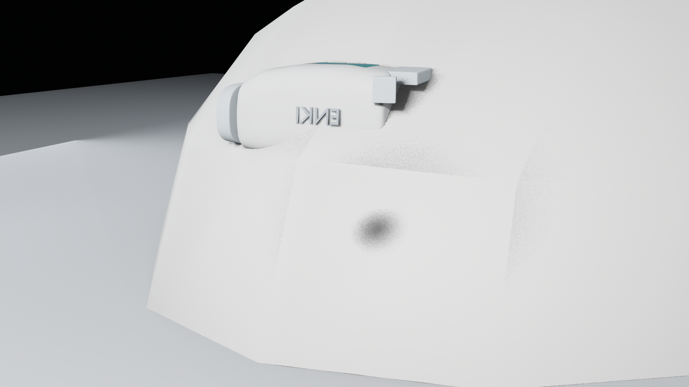
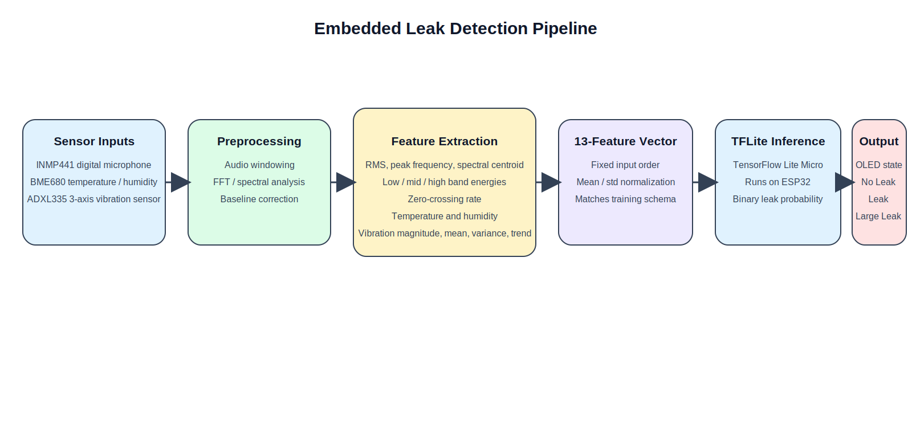
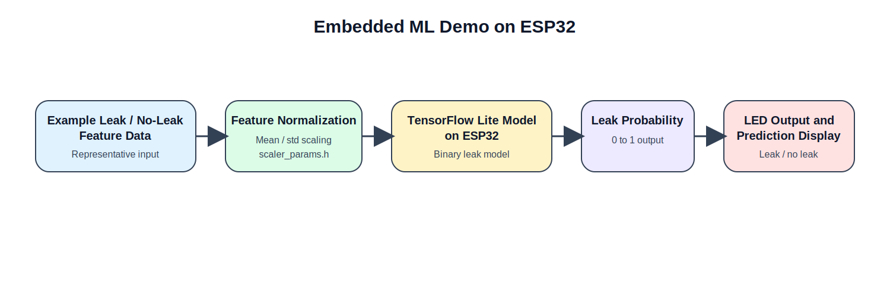

# ENKI Leak Detection

Curated portfolio repository for **ENKI**, an embedded leak-detection prototype that combines **ESP32 firmware**, **signal processing**, and **TensorFlow Lite Micro** for on-device leak classification.

This version is organized for technical review. It keeps the parts that matter for applications:

- production-oriented handheld and clamp firmware
- end-to-end ML training and export pipeline
- deployable TensorFlow Lite artifacts
- feature engineering and validation materials
- presentation and report assets that document the system design



## What This Project Does

The system monitors water pipe conditions using:

- an `INMP441` digital microphone
- a vibration sensor / analog accelerometer
- a `BME680` environmental sensor
- an `ESP32` running local signal processing and model inference

The live firmware extracts acoustic and vibration features, normalizes them using the same scaler used during training, runs a TensorFlow Lite Micro model on the ESP32, and then updates local outputs such as an OLED display and RGB LED state.

## System Architecture



The full stack is split into two device styles:

- **TRIDENT handheld** for close-range inspection and leak localization
- **CLAM clamp nodes** for mounted monitoring on different pipe sections

The current deployable model is a **binary classifier**:

- `no_leak`
- `leak`

Final leak severity shown on-device is determined by combining the model score with additional firmware rules and sensor thresholds.

## Repository Highlights

- **Firmware**: final handheld and clamp sketches, model headers, scaler headers, and validation builds
- **ML pipeline**: synthetic data generation, manifest building, feature extraction, training, evaluation, TFLite export, and firmware conversion
- **Artifacts**: trained Keras model, scaler JSON, metrics, TFLite files, and Arduino-ready model arrays
- **Documentation**: selected report appendices, results notes, presentation diagrams, and issue notes

## Repository Structure

```text
.
|-- assets/
|   |-- diagrams/
|   `-- images/
|-- firmware/
|   |-- handheld_trident/
|   |-- clam_node1/
|   |-- clam_node2/
|   `-- clamp_validation/
|-- ml/
|   |-- configs/
|   |-- data/
|   |-- exports/
|   |-- models/
|   |-- scripts/
|   `-- src/
|-- docs/
|   |-- report_appendices/
|   `-- ...
`-- run_*.ps1
```

## Key Firmware Entry Points

- Handheld production-style sketch: [`firmware/handheld_trident/final_model_demo_handheld.ino`](firmware/handheld_trident/final_model_demo_handheld.ino)
- Clamp node 1 sketch: [`firmware/clam_node1/Clamp01.ino`](firmware/clam_node1/Clamp01.ino)
- Clamp node 2 sketch: [`firmware/clam_node2/Clamp02.ino`](firmware/clam_node2/Clamp02.ino)
- Half-inch validation / tuning sketch: [`firmware/clamp_validation/Clamp01_node1_clean_test.ino`](firmware/clamp_validation/Clamp01_node1_clean_test.ino)

More context for the firmware folders is in [`firmware/README.md`](firmware/README.md).

## Machine Learning Pipeline



The ML workflow is fully included in this repo:

1. generate or collect audio data
2. build a manifest
3. extract engineered features
4. train a compact binary classifier
5. evaluate model performance
6. export to TensorFlow Lite
7. convert the TFLite model into Arduino-ready C arrays
8. deploy the same model and scaler parameters to the ESP32 firmware

The current model uses **13 ordered features**:

1. `rms`
2. `peak_frequency_hz`
3. `spectral_centroid_hz`
4. `low_band_energy`
5. `mid_band_energy`
6. `high_band_energy`
7. `zero_crossing_rate`
8. `temperature_c`
9. `humidity_pct`
10. `vibration_magnitude`
11. `vibration_mean`
12. `vibration_variance`
13. `vibration_trend`

## Included Model Artifacts

The repo includes the final model outputs needed to review the deployment path:

- trained Keras model: [`ml/models/leak_binary_classifier.keras`](ml/models/leak_binary_classifier.keras)
- scaler parameters: [`ml/models/scaler_params.json`](ml/models/scaler_params.json)
- metrics summary: [`ml/models/metrics.json`](ml/models/metrics.json)
- float TFLite model: [`ml/exports/leak_model_float.tflite`](ml/exports/leak_model_float.tflite)
- int8 TFLite model: [`ml/exports/leak_model_int8.tflite`](ml/exports/leak_model_int8.tflite)
- firmware-exported model arrays: [`ml/exports/firmware_model/`](ml/exports/firmware_model)

## Validation Snapshot

- synthetic dataset classes: `no_leak`, `small_leak`, `medium_leak`, `large_leak`
- manifest size in current training snapshot: `160` clips
- saved split sizes: `112` train / `24` validation / `24` test
- current saved metrics on the synthetic split: accuracy, precision, recall, F1, and ROC AUC all reported as `1.0`
- real pipe validation work is documented in the selected appendix notes under [`docs/report_appendices/`](docs/report_appendices)

## Quick Start

Use Python `3.11` on Windows for the ML environment.

```powershell
python -m venv .venv
.venv\Scripts\Activate.ps1
pip install -r ml\requirements.txt
python ml\scripts\generate_synthetic_audio.py
python ml\scripts\build_manifest.py
python ml\scripts\extract_features.py
python ml\scripts\train_model.py
python ml\scripts\evaluate_model.py
python ml\scripts\export_tflite.py --quantize none
python ml\scripts\export_tflite.py --quantize int8
python ml\scripts\tflite_to_c_array.py
```

Helpful utilities:

```powershell
.\run_audio_baseline.ps1
.\run_audio_visualizations.ps1
.\run_demo_audio.ps1
```

## Public Repo Notes

- Private Wi-Fi and AWS IoT credentials were intentionally removed from this portfolio version.
- Clamp firmware includes an example config header name, but cloud publishing is disabled by default in the checked-in sketches.
- This repository is a curated public snapshot, so it excludes classroom secrets, local virtual environments, and bulky intermediate files that do not help technical review.

## Selected Documentation

- Firmware appendix: [`docs/report_appendices/appendix_a_esp32_arduino_firmware.md`](docs/report_appendices/appendix_a_esp32_arduino_firmware.md)
- ML appendix: [`docs/report_appendices/appendix_b_machine_learning_tensorflow_model.md`](docs/report_appendices/appendix_b_machine_learning_tensorflow_model.md)
- Feature equations appendix: [`docs/report_appendices/appendix_c_feature_extraction_equations.md`](docs/report_appendices/appendix_c_feature_extraction_equations.md)
- Report snapshot: [`docs/report_appendices/final_report_for_upload.md`](docs/report_appendices/final_report_for_upload.md)
- Half-inch reference table: [`docs/report_appendices/half_inch_pipe_reference_table.md`](docs/report_appendices/half_inch_pipe_reference_table.md)

## Portfolio Context

This repository is the version I would share for technical interviews and applications. It is meant to show the full implementation path from:

- feature design
- training and export tooling
- embedded inference on the ESP32
- live device firmware behavior
- supporting documentation and validation material

