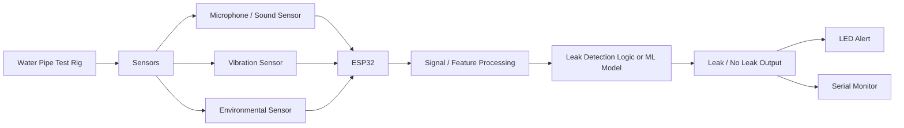
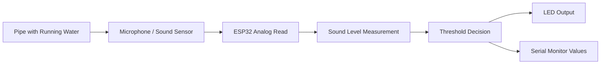
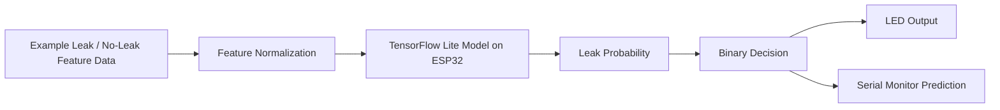
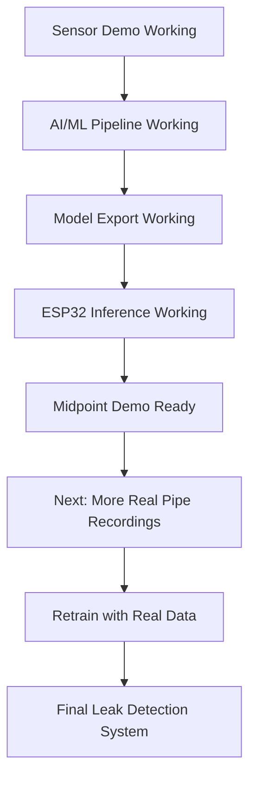

# 09 Midpoint Presentation Pack

This file contains the main pipeline and block diagrams that should be included in the presentation. The goal is to keep the story simple, clear, and honest.

## Slide 1: Overall System Block Diagram

Use this as the main system overview slide.

Short explanation:

`This diagram shows the full system. The sensors collect data from the pipe, the ESP32 processes that data, and the system gives a leak or no-leak output through the LED and Serial Monitor.`

## Slide 2: AI/ML Development Pipeline

Use this as the AI/ML methodology slide.

```mermaid
flowchart LR
    A["Audio Data"] --> B["Labeling and Manifest"]
    B --> C["Feature Extraction"]
    C --> D["Training Dataset"]
    D --> E["TensorFlow Model Training"]
    E --> F["Model Evaluation"]
    F --> G["TensorFlow Lite Export"]
    G --> H["Arduino Model Files"]
    H --> I["ESP32 Deployment"]
```

Short explanation:

`This is the AI/ML pipeline. The data is labeled, features are extracted, the model is trained and evaluated in TensorFlow, then the final model is exported and deployed to the ESP32.`

## Slide 3: Live Sensing Demo Block Diagram

Use this for the real-time pipe demo.

Short explanation:

`This live demo shows the sensing path. The sensor reads sound from the pipe, the ESP32 measures the signal level, and the LED responds when the sound level crosses the threshold.`

## Slide 4: Embedded ML Demo Block Diagram

Use this for the ESP32 model demo.

Short explanation:

`This demo shows the machine learning side. The ESP32 runs the TensorFlow Lite model on example feature data, produces a leak probability, and then turns the LED on or off based on the final binary decision.`

## Slide 5: Current Progress and Next Steps

Use this as the progress slide.

Short explanation:

`This shows the current progress of the project. The sensing path and embedded ML pipeline are already working, and the next major step is collecting more real pipe recordings to improve the final model.`

## Recommended Slide Order

1. Overall System Block Diagram
2. AI/ML Development Pipeline
3. Live Sensing Demo
4. Embedded ML Demo
5. Current Progress and Next Steps

## Short Speaker Notes

### Overall System
`The system collects sensor data from the pipe, processes it on the ESP32, and gives a leak or no-leak output.`

### AI/ML Pipeline
`The model is trained on the computer, converted to TensorFlow Lite, and then deployed to the ESP32.`

### Live Demo
`This part shows the real-time sensing path using the sound sensor on the pipe.`

### ML Demo
`This part shows the ESP32 running the trained model and producing a leak or no-leak prediction.`

### Progress
`The current system already supports embedded inference and live sensing, and the next step is improving the model with more real pipe data.`
